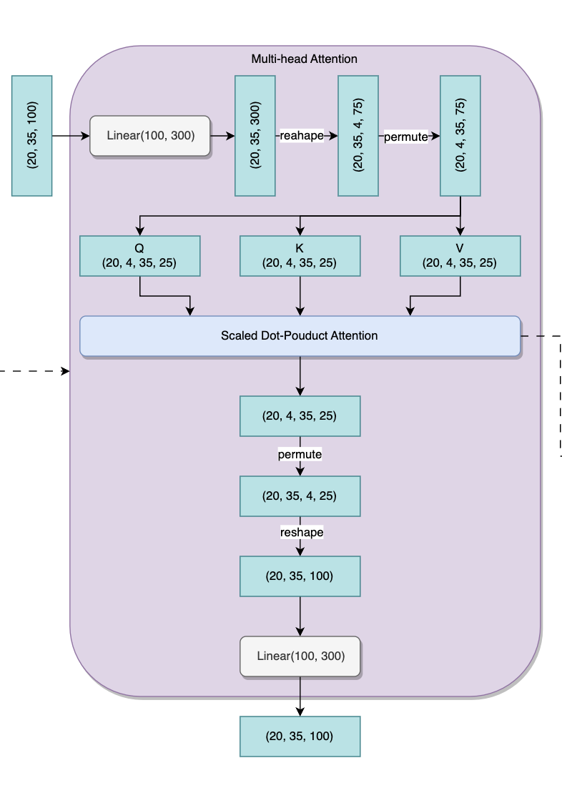

# Transformer Architecture Implementation

The Transformer architecture, introduced in the paper "Attention is All You Need" by Vaswani et al., has revolutionized the field of natural language processing. Our repository offers a detailed, from-scratch implementation of this groundbreaking model, and I also include a Transformer version SeqToSeq Model in this repository

## Overview

Transformers employ a mechanism called self-attention that allows them to weigh input features differently, capturing intricate relationships in data, whether they're close together or far apart in the input sequence. This feature distinguishes Transformers from RNNs and CNNs, making them especially effective for sequence-to-sequence tasks.

## Model Structure

### Input Embedding
The input tokens are first converted into vectors using embeddings. These embeddings are then positionally encoded to maintain the sequence's order.

### Multi-Head Self-Attention
Multiple self-attention heads allow the model to focus on different parts of the input for various tasks or reasoning. This is where the Query, Key, and Value matrices play a pivotal role.

### Residual Connection and Normalization

After the attention scores are obtained, the results are passed through feed-forward neural networks independently at each position.

Each sub-layer (like multi-head attention or feed-forward neural network) in the model has a residual connection around it followed by layer normalization.

### Scaled Dot Product Attention

